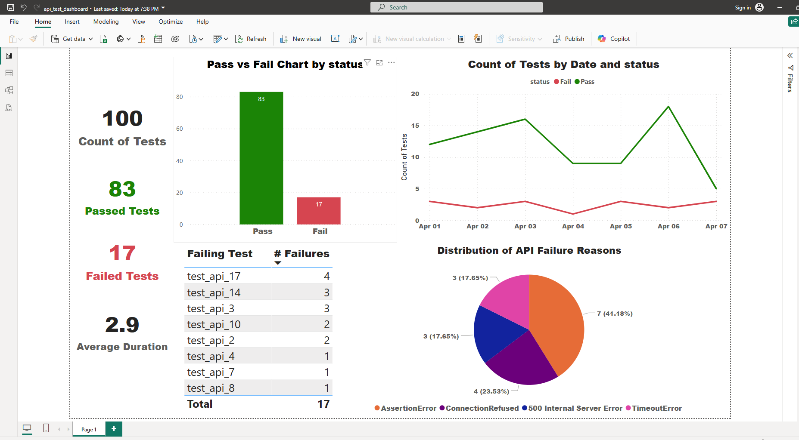

# 🧪 API Test Analysis Project

This project demonstrates how to combine QA automation insights with data analysis and visualization techniques.  
We analyze a set of automated API test results using **Pandas**, **Seaborn**, and **Power BI**.

---

## 📁 Project Structure

```
api_test_analysis/
│
├── data/
│   └── test_results.csv             # API test result data
│
├── notebooks/
│   └── api_test_analysis.ipynb     # Jupyter notebook for data analysis
│
├── powerbi/
│   └── api_test_dashboard.pbix     # Power BI dashboard
│   └── dashboard_screenshot.png    # Power BI snapshot
│
├── README.md
└── requirements.txt
```

---

## 📊 Analysis Overview (Notebook)

- Pass vs Fail distribution
- Longest test durations
- Most frequently failing test cases
- Error message insights

---

## 📈 Power BI Dashboard

The same data is also visualized with Power BI for a more interactive business-friendly overview:
- Test results summary
- Execution duration trends
- Frequent failures and error types

---

## ▶️ How to Run This Project

1. Create a virtual environment and activate it.
2. Install required Python libraries:

```bash
pip install -r requirements.txt
```

3. Launch the notebook:

```bash
jupyter notebook notebooks/api_test_analysis.ipynb
```

4. Open `api_test_dashboard.pbix` in Power BI Desktop (optional).

---

## 📸 Dashboard Preview



## 🛠️ Tools Used

- Python (Pandas, Matplotlib, Seaborn)
- Jupyter Notebook
- Power BI Desktop

---
